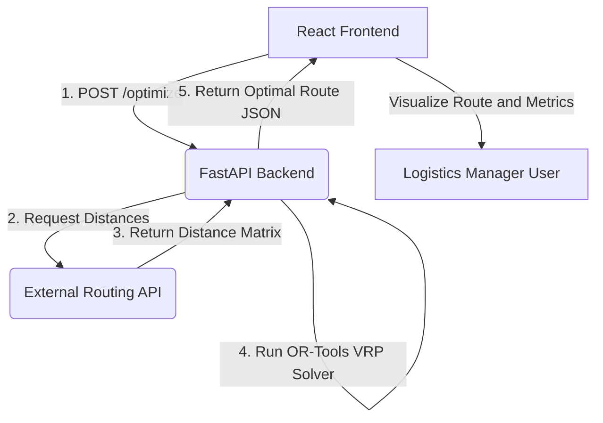

# 🗺️ OptiMap: Last-Mile Route Optimization

**A high-performance, full-stack platform built to minimize time and distance in last-mile logistics by solving the Vehicle Routing Problem (VRP).**

OptiMap demonstrates a critical product engineering capability: translating a complex algorithmic problem into a tangible, user-friendly, and cost-saving solution. It is built on a modern **decoupled microservices architecture** using FastAPI and React.

## 🚀 Key Features

* **VRP Solver:** Implements the **Vehicle Routing Problem (VRP)** using **Google OR-Tools** to determine the optimal sequence of stops for a single vehicle.
* **Geospatial Integration:** Uses external Routing APIs (e.g., OSRM) to calculate **accurate, real-world road travel times and distances** (the Distance Matrix), a critical input for the VRP algorithm.
* **Intuitive Visualization:** The React frontend displays the input stops and draws the **optimal route line** on an interactive map (e.g., React-Leaflet/Mapbox).
* **Value Quantification:** Provides clear metrics for **Total Distance Saved** and **Total Time Saved** compared to a naive sequential route.
* **Decoupled Architecture:** Built as a scalable, two-part system: a high-speed Python backend and a dedicated JavaScript frontend.

## 🛠️ Technology Stack

| Component | Technology | Role in OptiMap |
| :--- | :--- | :--- |
| **Backend (Algorithm)** | **FastAPI, Python** | Microservice for running optimization and API orchestration. |
| **Optimization Library**| **Google OR-Tools** | Core engine for solving the Traveling Salesperson Problem (TSP/VRP). |
| **Frontend (UX/Viz)**| **React, JavaScript** | Component-based UI for stop input and map rendering. |
| **Mapping** | **React-Leaflet / React-Mapbox-GL**| Library used for displaying and interacting with geographical data. |
| **MLOps/Infra** | **Docker** | Containerization of the FastAPI service for robust, reproducible deployment. |

## 📐 Decoupled Architecture Diagram

The system operates as two independent, containerized services communicating via a REST API, showcasing true product-ready architecture.



## 🚀 Quick Start

### One-Command Development Setup

Run both backend and frontend with a single command:

```bash
./dev.sh
```

This script will:
- ✅ Create virtual environment (if needed)
- ✅ Install all dependencies (backend + frontend)
- ✅ Start both servers concurrently
- ✅ Handle graceful shutdown with Ctrl+C

**Access the application:**
- 🌐 Frontend: http://localhost:5173
- 📡 Backend API: http://localhost:8000
- 📚 API Docs: http://localhost:8000/docs

### Manual Setup

<details>
<summary>Click to expand manual setup instructions</summary>

#### Backend Setup
```bash
# Create and activate virtual environment
python3 -m venv venv
source venv/bin/activate  # Windows: venv\Scripts\activate

# Install dependencies
pip install -r requirements.txt

# Run backend
cd backend
uvicorn app.main:app --host 0.0.0.0 --port 8000 --reload
```

#### Frontend Setup
```bash
# Install dependencies
cd frontend
npm install

# Configure environment
cp .env.example .env

# Run frontend
npm run dev
```
</details>

## 📋 Prerequisites

- **Python 3.8+** (tested with 3.13.2)
- **Node.js 18+** (tested with 22.15.0)
- **npm 10+**
