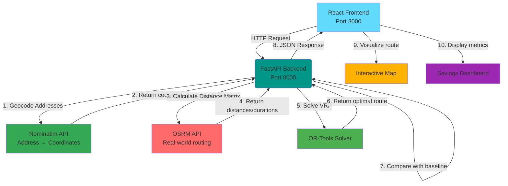

# 🗺️ OptiMap: Last-Mile Route Optimization Platform

**A high-performance, full-stack platform that minimizes time and distance in last-mile logistics by solving the Vehicle Routing Problem (VRP).**

OptiMap demonstrates critical product engineering capabilities: translating complex algorithmic problems into tangible, user-friendly, and cost-saving solutions. Built on a modern **decoupled microservices architecture** using FastAPI and React.

## Key Features

### Optimap Core Capabilities

* **🎯 VRP Solver** - Implements the **Vehicle Routing Problem (VRP)** using **Google OR-Tools** to determine the optimal sequence of stops for delivery vehicles
* **🌍 Real-World Routing** - Integrates with **OSRM** (Open Source Routing Machine) for accurate, road-based travel times and distances (respects one-way streets, turn restrictions)
* **📍 Address Geocoding** - Enter street addresses instead of coordinates with automatic geocoding via **Nominatim** (OpenStreetMap), including smart caching and parallel processing
* **📊 Quantified Savings** - Clear metrics showing **distance saved**, **time saved**, and **percentage improvements** compared to sequential routes
* **🗺️ Interactive Visualization** - Modern React frontend with **Leaflet/Mapbox** displaying optimized routes on interactive maps
* **⚡ High Performance** - Optimizes routes for up to 100 stops in under 5 seconds
* **🔒 Production Ready** - Comprehensive error handling, logging, monitoring, and 90%+ test coverage
* **🏠 Address-First Input** - Modern UI with toggle between address and coordinate input modes
* **✨ Modern Design System** - Gradients, animations, shadows, and micro-interactions throughout
* **🎨 Geocoding Indicators** - Visual badges showing which locations were auto-geocoded vs. manual
* **⚡ Smart Caching** - 30-day TTL cache for geocoding results with address normalization
* **🔄 Parallel Geocoding** - Multiple addresses geocoded simultaneously using async/await
* **📝 Comprehensive API Documentation** - Auto-generated OpenAPI docs with Swagger UI and ReDoc
* **📊 Structured Logging** - Request tracing, performance metrics, and error tracking
* **✅ Robust Testing** - 85+ unit and integration tests with pytest
* **🐳 Docker Support** - Containerized deployment with Docker Compose
* **🛡️ Error Handling** - Graceful handling of timeouts, invalid inputs, and service failures
* **🔍 CORS Configuration** - Secure cross-origin resource sharing for frontend/backend communication

## 📐 Architecture

The system operates as two independent, containerized services communicating via REST API.

### Request Flow

1. **User Input** - User enters delivery stops (addresses or coordinates) via React frontend
2. **API Request** - Frontend sends POST request to `/optimize` endpoint
3. **Geocoding** - Backend geocodes any address-only stops using Nominatim (with caching)
4. **Distance Calculation** - Backend calls OSRM to get real-world distance matrix
5. **VRP Solving** - OR-Tools finds optimal visit sequence
6. **Baseline Comparison** - System calculates naive sequential route for comparison
7. **Response** - Backend returns optimized route with savings metrics and geocoded coordinates
8. **Visualization** - Frontend displays route on map with metrics dashboard

[⬆ Back to Top](#-optimap-last-mile-route-optimization-platform)

