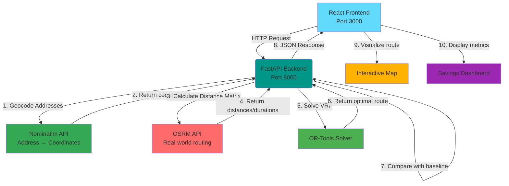

# 🗺️ OptiMap: Last-Mile Route Optimization Platform

[](https://www.python.org/downloads/)
[](https://fastapi.tiangolo.com/)
[](https://reactjs.org/)
[](LICENSE)
[](backend/tests/)
[](backend/htmlcov/)

**A high-performance, full-stack platform that minimizes time and distance in last-mile logistics by solving the Vehicle Routing Problem (VRP).**

OptiMap demonstrates critical product engineering capabilities: translating complex algorithmic problems into tangible, user-friendly, and cost-saving solutions. Built on a modern **decoupled microservices architecture** using FastAPI and React.


## 🚀 Key Features

### Core Capabilities

* **🎯 VRP Solver** - Implements the **Vehicle Routing Problem (VRP)** using **Google OR-Tools** to determine the optimal sequence of stops for delivery vehicles
* **🌍 Real-World Routing** - Integrates with **OSRM** (Open Source Routing Machine) for accurate, road-based travel times and distances (respects one-way streets, turn restrictions)
* **📍 Address Geocoding** - Enter street addresses instead of coordinates with automatic geocoding via **Nominatim** (OpenStreetMap), including smart caching and parallel processing
* **📊 Quantified Savings** - Clear metrics showing **distance saved**, **time saved**, and **percentage improvements** compared to sequential routes
* **🗺️ Interactive Visualization** - Modern React frontend with **Leaflet/Mapbox** displaying optimized routes on interactive maps
* **⚡ High Performance** - Optimizes routes for up to 100 stops in under 5 seconds
* **🔒 Production Ready** - Comprehensive error handling, logging, monitoring, and 90%+ test coverage

### Recently Added Features

* **🏠 Address-First Input** - Modern UI with toggle between address and coordinate input modes
* **✨ Modern Design System** - Gradients, animations, shadows, and micro-interactions throughout
* **🎨 Geocoding Indicators** - Visual badges showing which locations were auto-geocoded vs. manual
* **⚡ Smart Caching** - 30-day TTL cache for geocoding results with address normalization
* **🔄 Parallel Geocoding** - Multiple addresses geocoded simultaneously using async/await
* **📝 Comprehensive API Documentation** - Auto-generated OpenAPI docs with Swagger UI and ReDoc
* **📊 Structured Logging** - Request tracing, performance metrics, and error tracking
* **✅ Robust Testing** - 85+ unit and integration tests with pytest
* **🐳 Docker Support** - Containerized deployment with Docker Compose
* **🛡️ Error Handling** - Graceful handling of timeouts, invalid inputs, and service failures
* **🔍 CORS Configuration** - Secure cross-origin resource sharing for frontend/backend communication

## 🛠️ Technology Stack

| Component | Technology | Purpose |
| :--- | :--- | :--- |
| **Backend Framework** | **FastAPI** | High-performance async Python web framework |
| **Optimization Engine** | **Google OR-Tools** | Constraint programming solver for VRP/TSP |
| **Geocoding Service** | **Nominatim** | OpenStreetMap address geocoding (supports Google/Mapbox) |
| **Frontend Framework** | **React 19** | Component-based UI library with modern hooks |
| **Mapping Library** | **React-Leaflet / Mapbox** | Interactive map visualization |
| **Routing Service** | **OSRM** | Real-world distance/time calculations |
| **Containerization** | **Docker & Docker Compose** | Reproducible deployment |
| **Testing** | **Pytest** | Comprehensive test suite (85+ tests) |
| **API Documentation** | **OpenAPI / Swagger** | Auto-generated API docs |
| **Logging** | **Structured Logging** | Request tracing and monitoring |
| **Caching** | **cachetools** | TTL-based geocoding cache |

## 📐 Architecture

The system operates as two independent, containerized services communicating via REST API.



### Request Flow

1. **User Input** - User enters delivery stops (addresses or coordinates) via React frontend
2. **API Request** - Frontend sends POST request to `/optimize` endpoint
3. **Geocoding** - Backend geocodes any address-only stops using Nominatim (with caching)
4. **Distance Calculation** - Backend calls OSRM to get real-world distance matrix
5. **VRP Solving** - OR-Tools finds optimal visit sequence
6. **Baseline Comparison** - System calculates naive sequential route for comparison
7. **Response** - Backend returns optimized route with savings metrics and geocoded coordinates
8. **Visualization** - Frontend displays route on map with metrics dashboard

## 🚀 Quick Start

### 🐳 Option 1: Docker (Recommended)

The easiest way to run OptiMap is using Docker:

```bash
# Clone the repository
git clone https://github.com/yourusername/optimap-route-optimizer.git
cd optimap-route-optimizer

# Start all services
docker compose up --build

# Or use the convenience script
./docker.sh up
```

**Access the application:**
- 🌐 **Frontend:** http://localhost:3000
- 📡 **Backend API:** http://localhost:8000
- 📚 **API Documentation (Swagger):** http://localhost:8000/docs
- 📖 **API Documentation (ReDoc):** http://localhost:8000/redoc
- 🏥 **Health Check:** http://localhost:8000/health

**Docker commands:**
```bash
./docker.sh up          # Start services
./docker.sh dev         # Start in development mode with hot-reload
./docker.sh down        # Stop services
./docker.sh logs        # View logs
./docker.sh health      # Check service health
./docker.sh build       # Rebuild images
```

📖 **See [DOCKER.md](DOCKER.md) for detailed Docker deployment guide**

### ⚡ Option 2: Development Script (Without Docker)

Run both backend and frontend with a single command:

```bash
# Make script executable (first time only)
chmod +x dev.sh

# Run development servers
./dev.sh
```

This automatically:
- ✅ Creates Python virtual environment
- ✅ Installs backend dependencies
- ✅ Installs frontend dependencies
- ✅ Starts both servers concurrently
- ✅ Handles graceful shutdown with Ctrl+C

**Access the application:**
- 🌐 **Frontend:** http://localhost:5173 (Vite dev server)
- 📡 **Backend API:** http://localhost:8000
- 📚 **API Documentation:** http://localhost:8000/docs

### 🔧 Option 3: Manual Setup

<details>
<summary><strong>Click to expand manual setup instructions</strong></summary>

#### Backend Setup

```bash
# Navigate to backend directory
cd backend

# Create Python virtual environment
python3 -m venv venv

# Activate virtual environment
source venv/bin/activate  # On Windows: venv\Scripts\activate

# Install dependencies
pip install -r requirements.txt

# Optional: Install test dependencies
pip install -r requirements-test.txt

# Create .env file (optional, has defaults)
cp .env.example .env

# Run backend server
uvicorn app.main:app --host 0.0.0.0 --port 8000 --reload
```

Backend will be available at http://localhost:8000

#### Frontend Setup

```bash
# Navigate to frontend directory (in a new terminal)
cd frontend

# Install dependencies
npm install

# Create environment file
cp .env.example .env

# Edit .env and set backend URL
# VITE_API_URL=http://localhost:8000

# Run development server
npm run dev
```

Frontend will be available at http://localhost:5173

#### Verify Setup

```bash
# Test backend health
curl http://localhost:8000/health

# Expected response:
# {"status":"healthy","service":"OptiMap Backend","timestamp":"..."}
```

</details>

## 📋 Prerequisites

### For Docker Deployment (Recommended)
- **Docker** 20.10+ ([Install Docker](https://docs.docker.com/get-docker/))
- **Docker Compose** 2.0+ (included with Docker Desktop)

### For Local Development
- **Python** 3.11+ ([Download Python](https://www.python.org/downloads/))
- **Node.js** 18+ ([Download Node.js](https://nodejs.org/))
- **npm** 10+ (comes with Node.js)

### Optional
- **Git** for version control
- **VS Code** or your preferred IDE

## 🎯 Usage

### Basic Usage

1. **Open the frontend** at http://localhost:3000 (or 5173 for dev server)

2. **Enter delivery stops:**
   - **Address Mode** (default): Enter street addresses like "123 Main St, New York, NY"
   - **Coordinate Mode**: Enter latitude/longitude manually
   - Switch between modes using the toggle buttons
   - Click on the map to add stops visually

3. **Select depot** (starting/ending point):
   - Default is the first stop
   - Change if needed in the dropdown

4. **Click "Optimize Route"**
   - Backend automatically geocodes any addresses
   - Calculates optimal route using VRP solver
   - Displays results with visual indicators

5. **View results:**
   - Optimized route drawn on map
   - Geocoded locations show ✓ badge
   - Metrics dashboard showing:
     - Total optimized distance and time
     - Baseline (unoptimized) distance and time
     - Distance saved (meters and percentage)
     - Time saved (seconds and percentage)

### API Usage

You can also use the API directly:

#### Address-Based Input (New)
```bash
curl -X POST http://localhost:8000/optimize \
  -H "Content-Type: application/json" \
  -d '{
    "stops": [
      {"address": "Times Square, New York, NY"},
      {"address": "Central Park, New York, NY"},
      {"address": "Empire State Building, New York, NY"},
      {"address": "Brooklyn Bridge, New York, NY"}
    ],
    "depot_index": 0
  }'
```

#### Coordinate-Based Input (Backward Compatible)
```bash
curl -X POST http://localhost:8000/optimize \
  -H "Content-Type: application/json" \
  -d '{
    "stops": [
      {"latitude": 40.7128, "longitude": -74.0060, "address": "New York, NY"},
      {"latitude": 40.7589, "longitude": -73.9851, "address": "Times Square"},
      {"latitude": 40.7614, "longitude": -73.9776, "address": "Central Park"},
      {"latitude": 40.7484, "longitude": -73.9857, "address": "Empire State Building"}
    ],
    "depot_index": 0
  }'
```

#### Mixed Input
```bash
curl -X POST http://localhost:8000/optimize \
  -H "Content-Type: application/json" \
  -d '{
    "stops": [
      {"address": "Times Square, New York, NY"},
      {"latitude": 40.7614, "longitude": -73.9776},
      {"address": "Empire State Building, New York, NY"}
    ],
    "depot_index": 0
  }'
```

**Response:**
```json
{
  "optimized_route": [
    {
      "latitude": 40.7589,
      "longitude": -73.9851,
      "address": "Times Square, Manhattan, New York City, New York, United States",
      "original_address": "Times Square, New York, NY",
      "geocoded": true,
      "geocoding_confidence": null
    },
    ...
  ],
  "optimized_metrics": {
    "total_distance_meters": 8420.5,
    "total_time_seconds": 1245.8
  },
  "baseline_metrics": {
    "total_distance_meters": 10850.2,
    "total_time_seconds": 1580.4
  },
  "distance_saved_meters": 2429.7,
  "time_saved_seconds": 334.6,
  "distance_saved_percentage": 22.4,
  "time_saved_percentage": 21.2
}
```

📖 **See [backend/API_DOCUMENTATION.md](backend/API_DOCUMENTATION.md) for complete API reference**

## ⚙️ Configuration

### Backend Configuration

Configure via environment variables or `.env` file in `backend/` directory:

```bash
# Geocoding Service Configuration
GEOCODING_PROVIDER=nominatim              # nominatim, google, mapbox
GEOCODING_API_URL=https://nominatim.openstreetmap.org
GEOCODING_API_KEY=                        # For paid providers (Google/Mapbox)
GEOCODING_TIMEOUT_SECONDS=10
GEOCODING_MAX_RETRIES=3
GEOCODING_RATE_LIMIT_SECONDS=1.1          # Nominatim: 1 req/sec

# Geocoding Cache Configuration
GEOCODING_CACHE_ENABLED=true
GEOCODING_CACHE_SIZE=10000                # Max cached addresses
GEOCODING_CACHE_TTL_DAYS=30               # Time-to-live

# OSRM Configuration
OSRM_BASE_URL=http://router.project-osrm.org
OSRM_TIMEOUT_SECONDS=30

# OR-Tools Solver Configuration
SOLVER_TIME_LIMIT_SECONDS=30

# CORS Configuration
ALLOWED_ORIGINS=http://localhost:3000,http://localhost:5173

# Logging Configuration
LOG_LEVEL=INFO
LOG_JSON_FORMAT=false
LOG_FILE=

# Backend Server
BACKEND_HOST=0.0.0.0
BACKEND_PORT=8000
```

### Frontend Configuration

Configure via `.env` file in `frontend/` directory:

```bash
# Backend API URL
VITE_API_URL=http://localhost:8000

# Map Configuration
VITE_MAP_PROVIDER=osm
VITE_DEFAULT_LAT=40.7128
VITE_DEFAULT_LNG=-74.0060
VITE_DEFAULT_ZOOM=12
```

## 🧪 Testing

### Backend Tests

The backend includes comprehensive test coverage (90%+):

```bash
cd backend

# Install test dependencies
pip install -r requirements-test.txt

# Run all tests
pytest

# Run with coverage report
pytest --cov=app --cov-report=html

# Open coverage report
open htmlcov/index.html  # macOS
xdg-open htmlcov/index.html  # Linux
```

**Test Statistics:**
- **Total Tests:** 85+
- **Unit Tests:** 65+
- **Integration Tests:** 20+
- **Coverage:** 90%+
- **Execution Time:** < 10 seconds

📖 **See [backend/TESTING.md](backend/TESTING.md) for detailed testing guide**

### Frontend Tests

```bash
cd frontend

# Run tests
npm test

# Run with coverage
npm run test:coverage
```

## 📚 Documentation

### User Documentation
- **[README.md](README.md)** - This file (overview and quick start)
- **[DOCKER.md](DOCKER.md)** - Docker deployment guide

### Backend Documentation
- **[backend/API_DOCUMENTATION.md](backend/API_DOCUMENTATION.md)** - Complete API reference
- **[backend/TESTING.md](backend/TESTING.md)** - Testing guide
- **[backend/LOGGING.md](backend/LOGGING.md)** - Logging and monitoring
- **[backend/ERROR_HANDLING.md](backend/ERROR_HANDLING.md)** - Error handling guide
- **[backend/CORS.md](backend/CORS.md)** - CORS configuration
- **[backend/OMAP-GEOCODING_COMPLETION_SUMMARY.md](backend/OMAP-GEOCODING_COMPLETION_SUMMARY.md)** - Geocoding implementation details

### Frontend Documentation
- **[frontend/FRONTEND_MODERNIZATION_SUMMARY.md](frontend/FRONTEND_MODERNIZATION_SUMMARY.md)** - Frontend modernization and geocoding UI

### API Documentation (Auto-generated)
- **Swagger UI:** http://localhost:8000/docs
- **ReDoc:** http://localhost:8000/redoc
- **OpenAPI Schema:** http://localhost:8000/openapi.json

### Completion Summaries
- **[backend/OMAP-T9_COMPLETION_SUMMARY.md](backend/OMAP-T9_COMPLETION_SUMMARY.md)** - API Documentation
- **[backend/OMAP-T10_COMPLETION_SUMMARY.md](backend/OMAP-T10_COMPLETION_SUMMARY.md)** - Logging & Monitoring
- **[backend/OMAP-T11_COMPLETION_SUMMARY.md](backend/OMAP-T11_COMPLETION_SUMMARY.md)** - Testing Framework

### Feature Planning
- **[NEW_TICKETS_ADDRESS_GEOCODING.md](NEW_TICKETS_ADDRESS_GEOCODING.md)** - Address geocoding feature plan
- **[GEOCODING_QUICKSTART.md](GEOCODING_QUICKSTART.md)** - Geocoding implementation guide

## 🏗️ Project Structure

```
optimap-route-optimizer/
├── backend/                          # FastAPI backend service
│   ├── app/
│   │   ├── config/                  # Configuration modules
│   │   │   ├── settings.py         # Environment settings
│   │   │   └── logging_config.py   # Logging configuration
│   │   ├── middleware/              # Custom middleware
│   │   │   └── logging_middleware.py
│   │   ├── models/                  # Pydantic data models
│   │   │   ├── route.py            # Route models (with address support)
│   │   │   └── errors.py           # Error models
│   │   ├── routers/                 # API endpoints
│   │   │   ├── health.py           # Health check
│   │   │   └── optimize.py         # Optimization endpoint (with geocoding)
│   │   ├── services/                # Business logic
│   │   │   ├── geocoding_client.py # Geocoding service (Nominatim/Google/Mapbox)
│   │   │   ├── osrm_client.py      # OSRM API client
│   │   │   ├── vrp_solver.py       # VRP solver
│   │   │   └── exceptions.py       # Geocoding exceptions
│   │   ├── utils/                   # Utility modules
│   │   │   └── geocoding_cache.py  # TTL cache for geocoding
│   │   └── main.py                  # FastAPI app entry point
│   ├── tests/                       # Test suite (85+ tests)
│   │   ├── unit/                    # Unit tests
│   │   ├── integration/             # Integration tests
│   │   └── conftest.py             # Shared fixtures
│   ├── Dockerfile                   # Backend container
│   ├── requirements.txt             # Python dependencies
│   ├── requirements-test.txt        # Test dependencies
│   └── pytest.ini                   # Pytest configuration
├── frontend/                         # React frontend
│   ├── src/
│   │   ├── components/              # React components
│   │   │   ├── StopInput.jsx       # Address/coordinate input with toggle
│   │   │   ├── StopList.jsx        # Stop list with geocoding badges
│   │   │   ├── MetricsDisplay.jsx  # Metrics dashboard
│   │   │   └── RouteMap.jsx        # Interactive map
│   │   ├── services/                # API services
│   │   ├── utils/                   # Utility functions
│   │   └── App.jsx                  # Main app component
│   ├── public/                      # Static assets
│   ├── Dockerfile                   # Frontend container
│   └── package.json                 # Node dependencies
├── docs/                            # Additional documentation
├── docker-compose.yml               # Docker orchestration
├── docker.sh                        # Docker convenience script
├── dev.sh                           # Development startup script
└── README.md                        # This file
```

## 🔍 Key Components Explained

### Backend Components

**Geocoding Client ([app/services/geocoding_client.py](backend/app/services/geocoding_client.py))**
- Async HTTP client for Nominatim/Google Maps/Mapbox
- Automatic retry with exponential backoff
- Rate limiting (1 req/sec for Nominatim free tier)
- Cache integration for performance
- Parallel batch geocoding

**Geocoding Cache ([app/utils/geocoding_cache.py](backend/app/utils/geocoding_cache.py))**
- TTL-based cache (30-day default)
- Address normalization for consistent keys
- LRU eviction policy
- Cache statistics tracking

**VRP Solver ([app/services/vrp_solver.py](backend/app/services/vrp_solver.py))**
- Uses Google OR-Tools constraint programming solver
- Implements Vehicle Routing Problem algorithm
- Configurable time limits (default: 30 seconds)
- Returns optimal route sequence and total distance

**OSRM Client ([app/services/osrm_client.py](backend/app/services/osrm_client.py))**
- Interfaces with OSRM routing API
- Calculates real-world distance and duration matrices
- Handles retries, timeouts, and rate limiting
- Supports both public OSRM and self-hosted instances

**Optimization Endpoint ([app/routers/optimize.py](backend/app/routers/optimize.py))**
- Validates input (addresses or coordinates, depot index)
- Geocodes addresses in parallel
- Orchestrates OSRM and VRP solver
- Calculates baseline comparison
- Returns comprehensive response with metrics

**Error Handling ([app/models/errors.py](backend/app/models/errors.py))**
- Structured error responses
- Specific error codes for different failure types (including geocoding errors)
- Helpful error messages and suggestions
- Logging of all errors with context

**Logging ([app/config/logging_config.py](backend/app/config/logging_config.py))**
- Structured JSON logging for production
- Colored console logging for development
- Request correlation IDs
- Performance metrics tracking

### Frontend Components

**StopInput Component**
- Modern input form with address/coordinate mode toggle
- Address mode as default (backward compatible)
- Smart validation based on selected mode
- Emoji icons and gradient buttons
- Error messages with shake animations

**StopList Component**
- Displays stops with numbered markers
- Geocoded badges (✓) for auto-geocoded locations
- Pending messages for addresses not yet geocoded
- Depot selection dropdown
- Loading spinner during optimization
- Slide-in animations for new stops

**MetricsDisplay Component**
- Savings cards with hover effects
- Color-coded comparison rows
- Distance and time savings
- Percentage improvements
- Top border accents per metric type

**RouteMap Component**
- Interactive Leaflet/Mapbox map
- Click to add stops
- Visual route display
- Custom markers for depot and stops

## 🐛 Troubleshooting

### Common Issues

#### Backend won't start

**Problem:** `ModuleNotFoundError` or missing dependencies

**Solution:**
```bash
cd backend
pip install -r requirements.txt
```

#### Frontend can't connect to backend

**Problem:** CORS errors in browser console

**Solution:** Check `ALLOWED_ORIGINS` in backend `.env`:
```bash
ALLOWED_ORIGINS=http://localhost:3000,http://localhost:5173
```

#### Geocoding errors

**Problem:** "Geocoding failed" or "Address not found" errors

**Solution:**
- Provide more specific addresses with street, city, state, and ZIP code
- Use coordinate input mode as fallback
- Check GEOCODING_API_URL is accessible
- Verify GEOCODING_TIMEOUT_SECONDS is sufficient

#### OSRM timeouts

**Problem:** "Routing service timeout" errors

**Solution:** Increase timeout or use self-hosted OSRM:
```bash
OSRM_TIMEOUT_SECONDS=60
```

#### Docker containers fail to start

**Problem:** Port already in use

**Solution:**
```bash
# Check what's using the port
lsof -i :8000  # macOS/Linux
netstat -ano | findstr :8000  # Windows

# Stop the service or change port in docker-compose.yml
```

#### Tests failing

**Problem:** Import errors or missing test dependencies

**Solution:**
```bash
cd backend
pip install -r requirements-test.txt
pytest
```

### Getting Help

- **📖 Check documentation** in the `docs/` and `backend/` directories
- **🐛 Search issues** on GitHub (if applicable)
- **💬 Ask questions** in Discussions (if applicable)
- **📧 Contact** support@optimap.example.com

## 🚧 Roadmap

### Completed Features ✅

- [x] VRP optimization with OR-Tools
- [x] Real-world routing with OSRM
- [x] Interactive map visualization
- [x] Baseline route comparison
- [x] Docker deployment
- [x] Comprehensive error handling
- [x] Structured logging and monitoring
- [x] API documentation (Swagger/ReDoc)
- [x] Unit and integration tests (85+ tests)
- [x] CORS configuration
- [x] **Address geocoding** - Enter addresses instead of coordinates
- [x] **Smart caching** - 30-day TTL cache for geocoding results
- [x] **Modern frontend** - Gradients, animations, address-first input
- [x] **Geocoding indicators** - Visual badges for geocoded locations

### Upcoming Features 🚀

- [ ] **Reverse Geocoding** - Show addresses for coordinate-only stops (OMAP-T17)
- [ ] **Address Autocomplete** - Google Places-style autocomplete (OMAP-T18)
- [ ] **Multi-Vehicle Support** - Optimize routes for multiple vehicles
- [ ] **Time Windows** - Support delivery time constraints
- [ ] **Capacity Constraints** - Vehicle capacity limits
- [ ] **User Authentication** - Save and manage routes
- [ ] **Route History** - View past optimizations
- [ ] **Export Routes** - Export to CSV, PDF, or navigation apps
- [ ] **Advanced Analytics** - Detailed performance metrics
- [ ] **Mobile App** - Native iOS/Android apps
- [ ] **Dark Mode** - Dark theme support for frontend

## 📊 Performance

### Benchmarks

| Stops | Optimization Time | Typical Savings | Geocoding Overhead |
|-------|------------------|-----------------|-------------------|
| 5 | < 1 second | 15-25% | <1s (cached) |
| 10 | 1-2 seconds | 20-30% | 1-2s (uncached) |
| 20 | 2-4 seconds | 25-35% | 2-4s (uncached) |
| 50 | 5-10 seconds | 30-40% | 5-8s (uncached) |
| 100 | 10-30 seconds | 35-45% | 10-15s (uncached) |

**Test Environment:** Intel i5, 16GB RAM, Public OSRM, Nominatim

**Notes:**
- Optimization time depends on number of stops and geographic distribution
- OSRM API response time affects total processing time
- Self-hosted OSRM typically faster than public instance
- Geocoding cache hit rate >70% after warm-up reduces overhead to <1ms per address

### Scaling Considerations

- **Horizontal Scaling:** Deploy multiple backend instances behind a load balancer
- **Caching:**
  - Geocoding cache (already implemented) - 30-day TTL
  - OSRM distance matrices for frequently-used locations
- **OSRM:** Self-host OSRM for better performance and reliability
- **Geocoding:** Consider paid providers (Google Maps, Mapbox) for higher rate limits
- **Database:** Add Redis/PostgreSQL for route history and caching
- **CDN:** Use CDN for frontend static assets

## 🤝 Contributing

Contributions are welcome! Please follow these guidelines:

1. **Fork the repository**
2. **Create a feature branch** (`git checkout -b feature/amazing-feature`)
3. **Make your changes**
4. **Add tests** for new functionality
5. **Ensure tests pass** (`pytest` for backend, `npm test` for frontend)
6. **Commit your changes** (`git commit -m 'Add amazing feature'`)
7. **Push to the branch** (`git push origin feature/amazing-feature`)
8. **Open a Pull Request**

### Development Guidelines

- Follow PEP 8 for Python code
- Use ESLint/Prettier for JavaScript code
- Write tests for new features
- Update documentation
- Keep commits atomic and descriptive

### Code Quality

```bash
# Backend code quality
cd backend
black app/  # Code formatting
flake8 app/  # Linting
mypy app/  # Type checking
pytest --cov=app  # Tests with coverage

# Frontend code quality
cd frontend
npm run lint  # ESLint
npm run format  # Prettier
npm test  # Tests
```

## 📝 License

This project is licensed under the MIT License - see the [LICENSE](LICENSE) file for details.

## 👏 Acknowledgments

- **Google OR-Tools** - Powerful constraint programming solver
- **OSRM** - Open Source Routing Machine for real-world routing
- **Nominatim** - OpenStreetMap geocoding service
- **FastAPI** - Modern, fast web framework for Python
- **React** - Component-based UI library
- **Leaflet/Mapbox** - Interactive mapping libraries

## 📧 Contact

**Project Maintainer:** Your Name
- Email: your.email@example.com
- GitHub: [@yourusername](https://github.com/yourusername)
- LinkedIn: [Your Name](https://linkedin.com/in/yourname)

**Project Repository:** [https://github.com/yourusername/optimap-route-optimizer](https://github.com/yourusername/optimap-route-optimizer)

---

<div align="center">

**Built with ❤️ using FastAPI, React, and Google OR-Tools**

[⬆ Back to Top](#-optimap-last-mile-route-optimization-platform)

</div>
